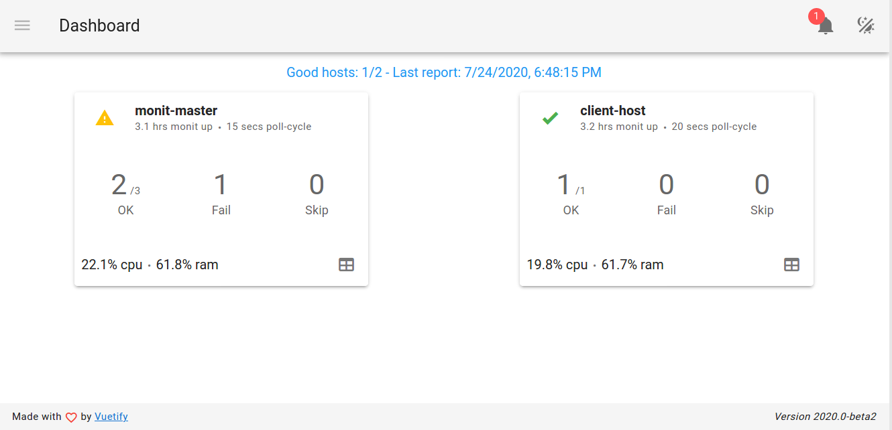

# Overview

CentMonit will help you centralize all your Monit agents reports into a single **simple & beautiful** dashboard.

But,... what is [Monit](https://www.mmonit.com/monit/)?

In case you missed it:
> Monit is a small Open Source utility for managing and monitoring Unix systems. Monit conducts automatic maintenance and repair and can execute meaningful causal actions in error situations.

In case you know it, yeap, the company behind Monit has [M/Monit](https://www.mmonit.com) for you to manage all Monit servers. But with so many features, its cost would make you disappointed and... its web UX/UI may also make you uncomfortable.


# Screenshoot

_Hosts report_


_Live events_


_Services detail_

](demo/cm3.png)


# Architecture


CentMonit has two main components:


*   Web Server: a single page application dashboard that shows reports about Monit agents
*   API server: a REST API gateway for Monit agents (to send report data) and for dashboard web (to consume report data)

Please note that, the API URL (host and port) must be accessible both from the agents’ network and system admin’s network.

# Setups

Clone this repository to your server, then go to bin directory to create a softlink to right binary version.
An example on Linux system:
```
cd /path/to/cloned/repo/bin
ln -sf centmonit-linux centmonit
```


# Configurations


## CentMonit


### Net group

Suppose that the Master Server’s public IP is **<code>100.1.2.3</code>** and its private one is **<code>192.168.1.1</code>**.

Open the **<code>config.yml</code>** and edit as follow:


```
net:
  webPort: 80
  apiHost: 100.1.2.3
  apiPort: 8080
```


Then, you could access the **web dashboard** by visiting **<code>[http://100.1.2.3:80](http://100.1.2.3:80)</code>**. In turn, the dashboard will get report data by invoking API URL at address **<code>[http://100.1.2.3:8080](http://100.1.2.3:8080)</code>**.

Start centmonit daemon with:


```
./control.sh start
```


To see help, just issue:


```
./control.sh
```


### Auth group

CentMonit supports HTTP Basic Auth with compatible htpasswd configuration, e.x:


```
auth:
 - john:$apr1$zdjw3n47$zra4fQBwxLk.BN3TYNoON0
```


Here, **<code>auth</code>** is an array, you can add as many users (with htpasswd password) as you like, e.x:


```
auth:
 - john:$apr1$zdjw3n47$zra4fQBwxLk.BN3TYNoON0
 - tyrion:$apr1$h3xajq2l$s7vxDirAiyYugPQWf/p9O.
```


You could use [online tool](https://www.web2generators.com/apache-tools/htpasswd-generator) to generate htpasswd password or issue a command on Linux terminal:


```
~$ htpasswd -n username
New password:
Re-type new password:
user:$apr1$hRQ3/ItK$z/hIyKxm2aby00x0L/JqA0
```


## Monit Agent

For Monit agent to send report data to CentMonit, edit its configuration file (usually at **<code>/etc/monitrc</code>**) as follow:


```
# Add this line to send report data to CentMonit
set mmonit http://192.168.1.1:8080/api/collector
```


Then, restart the monit daemon process.

**All done!**

**Now visit the web dashboard with default account (john/snow) to view the result.**


# Limitation

At this version, only maximum 02 Monit agents are supported.
